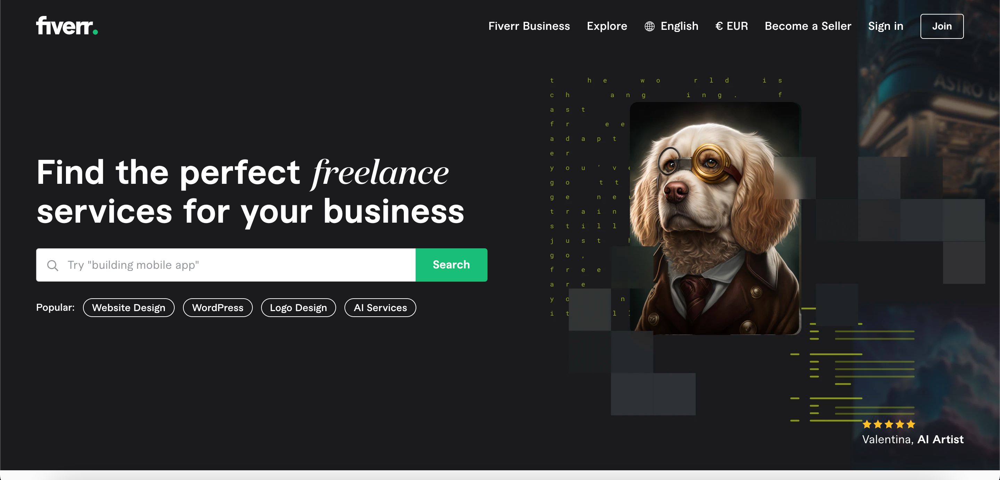
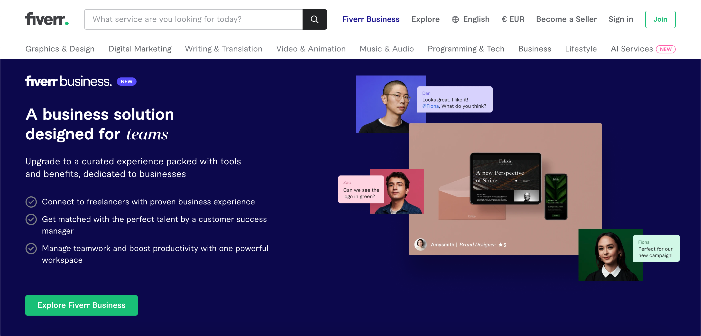
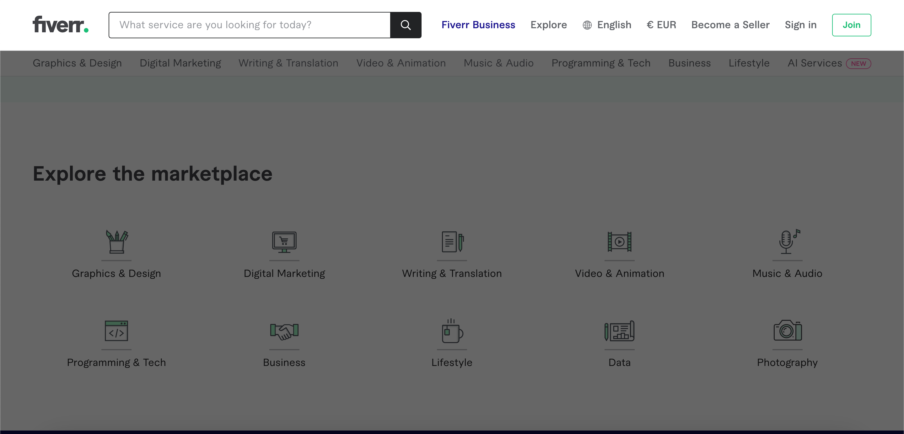
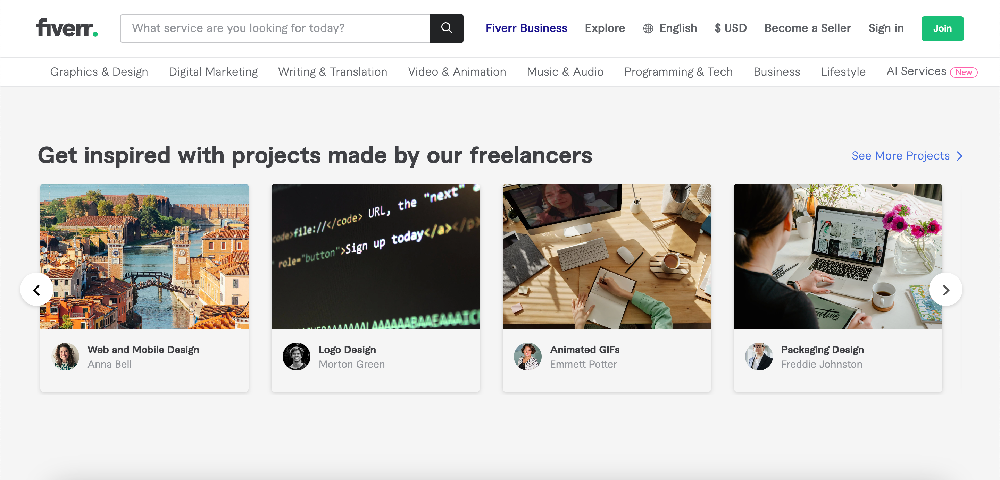
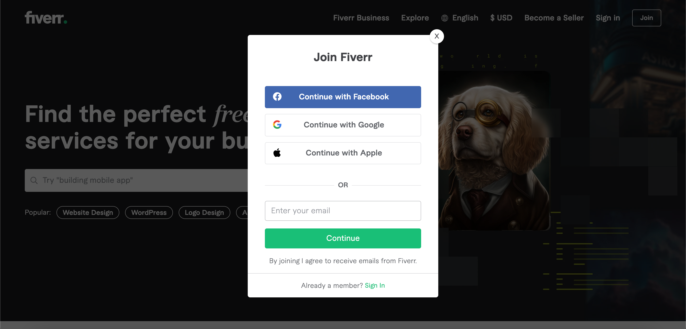

# Fiverr UI Clone with React

This is a Fiverr UI Clone with React. This project is a part of my React learning process. I have tried to clone the Fiverr UI as much as possible. I have used React, React Router Dom, Framer Motion, Infinite React Carousel, classNames, SCSS, and other libraries. If you want to use this project, you can use it for learning purposes. I will be happy if you can give me a star. _Thank you_ 😊.

## Table of Contents

- [Demo](#demo)
- [Screenshots](#screenshots)
- [Tech Stack](#tech-stack)
- [Installation](#installation)
- [Usage](#usage)
- [To Do](#to-do)

---

## Demo

[View Live Demo](https://azateser.github.io/fiverr-ui-clone/dist/)

---

## Screenshots












---

## Tech Stack

- [](https://reactjs.org/)

- [](https://sass-lang.com/)

- [](https://reactrouter.com/web/guides/quick-start)

- [](https://www.framer.com/motion/) [](https://www.npmjs.com/package/infinite-react-carousel)
  [](https://www.npmjs.com/package/classnames)

---

## Installation

Use the package manager [npm](https://www.npmjs.com/) to install the dependencies.

```bash
npm install
```

## Usage

```bash
npm run dev
```

---

## To Do

- [x] Reset CSS
- [x] Folder Structer
- [x] Create Pages
- [x] Navbar Component
- [x] React Router Dom
- [x] Home: Featured Component
- [x] Navbar | Active State 1 (Color)
- [x] Home: Featured Component
- [x] Home: Featured Component -> Slider Effect
- [x] Home: TrustedBy Component
- [x] Home: Infinite Slider (services area)
- [x] Navbar | Active State 2 (Search Bar & Menu)
- [x] Home: Fingertips Component
- [x] Home: Marketplace Component
- [x] Home: Business Component
- [x] Home: Product Slider Component
- [x] Footer Component
- [x] Login Modal
- [x] Join Modal
- [x] 404 Page
- [x] Add Live Demo

---

[Back To The Top](#fiverr-ui-clone-with-react)
